### Adrián Morente Gabaldón

# Práctica 1 - Seguridad y Protección de Sistemas Informáticos

***

Antes de empezar, haré unas consideraciones iniciales:

  - En cuanto a claves que serán utilizadas, tendremos:
    - Débil: 0101010101010101,
    - Semidébil: E001E001F101F101,
    - "Fuerte" (a elección del estudiante): 13804373ABAB43FE (para 64 bits. Se concatenará la misma clave **una vez** para claves de 128 bits, **dos veces** para 192, y **tres veces** para claves de 256).
  - El vector de inicialización a utilizar será 1234ABCDABCD1234 (para 64 bits, siguiendo la progresión del punto anterior pero adaptado al tamaño del bloque del algoritmo, en lugar del tamaño de la clave). Obviamente, éste se utilizará en todos los modos de cifrado excepto en ECB, que no se usa.
  - Utilizaremos siempre la opción `-nopad` que deshabilite la inserción que hace OpenSSL del último bloque a modo de padding, para evitar confusiones con el cifrado.

***

### 1. Partiremos de un archivo binario de 1024 bits, todos ellos con valor 0. Para hacer referencia al mismo voy a suponer que se llama input.bin, pero podéis dar el nombre que os convenga.

Para la creación de este fichero, necesitaremos un editor hexadecimal (en mi caso, utilizaré `GHex`). Para empezar, sabemos que 1024 bits son 128 bytes, o lo que es lo mismo, **128 parejas de dígitos en hexadecimal**. Bastará con crear un archivo binario en el editor que contenga 256 ceros:

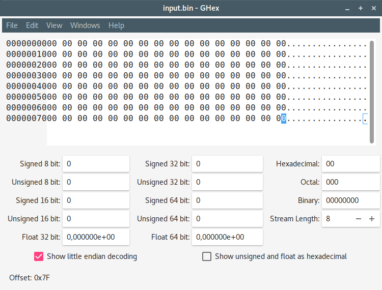

### 2. Creamos otro archivo binario del mismo tamaño, que contenga un único bit con valor 1 dentro de los primeros 40 bits y todos los demás con valor 0. Me referiré a este archivo como input1.bin.

A continuación del primer ejercicio, podemos copiar el archivo `input.bin` en uno nuevo llamado `input1.bin`, y con el editor hexadecimal cambiar uno de los dígitos hexadecimales, de cero a uno, dentro de los primeros 40 bits. Esto nos ayudará a distinguir el primer bloque de cifrado de cada algoritmo más adelante:

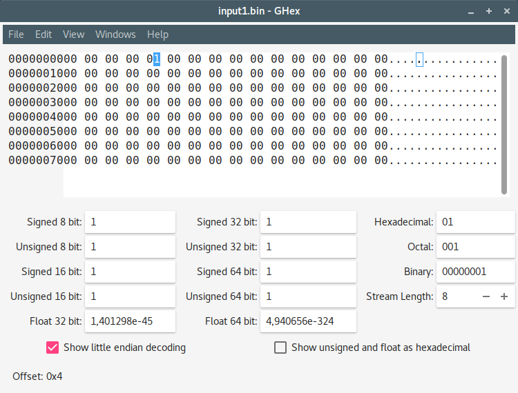

### 3. Cifrad input.bin con DES en modos ECB, CBC y OFB usando como claves una débil y otra semidébil, con vector de inicialización a vuestra elección, y explicad los diferentes resultados.

Usaremos las claves débiles y semidébiles, y el vector de inicialización mencionados al principio. Los puntos de este ejercicio comprenden los siguientes apartados:

  - ***Modo ECB con clave débil:***
  
  `openssl enc -des-ecb -in input.bin -out input-DES-ECB-debil.bin -K 0101010101010101 -nopad`
  
  

  - ***Modo ECB con clave semidébil:***
  
  `openssl enc -des-ecb -in input.bin -out input-DES-ECB-semidebil.bin -K E001E001F101F101 -nopad`
  
  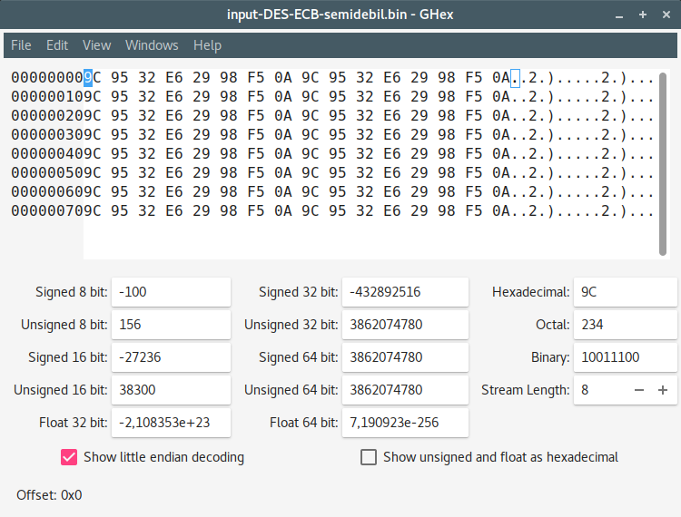

Dado el funcionamiento de ECB, vemos que en ambos binarios se genera un patrón repetido en todos los datos hexadecimales del archivo. Ya que ECB divide el mensaje en bloques de tamaño N y los cifra de forma independiente, y ya que nuestro archivo contiene el mismo valor (0) en todo el fichero; observamos la misma salida en cada uno de los bloques que componen el criptograma final.

  - ***Modo CBC con clave débil:***
  
  `openssl enc -des-cbc -in input.bin -out input-DES-CBC-debil.bin -K 0101010101010101 -iv 1234ABCDABCD1234 -nopad`
  
  

  - ***Modo CBC con clave semidébil:***
  
  `openssl enc -des-cbc -in input.bin -out input-DES-CBC-semidebil.bin -K E001E001F101F101 -iv 1234ABCDABCD1234 -nopad`
  
  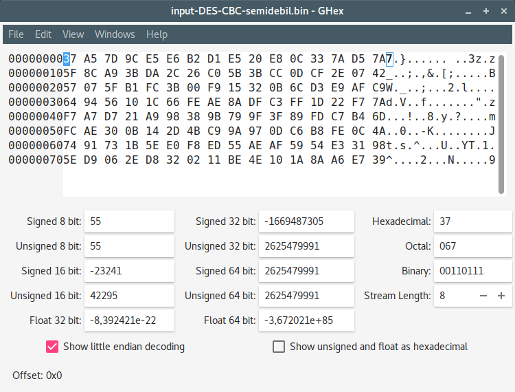

Sabemos que la esencia de CBC es aplicar a cada bloque de texto plano, antes de ser cifrado, la operación `XOR` con el bloque cifrado anterior; de forma que cada bloque dependa del anterior (y tanto la *difusión* como la *confusión* no se mantengan locales al bloque). Sin embargo, en todo nuestro fichero `input.bin` se estará realizando una operación `XOR` con **ceros**, y con una clave débil que sigue un patrón exacto, entonces el mensaje cifrado sigue un patrón como en ECB. Sin embargo, en cuanto a la clave semidébil, perdemos de vista un patrón repetido ya que los resultados de las operaciones `XOR` siguen otra distribución.

  - ***Modo OFB con clave débil:***

  `openssl enc -des-ofb -in input.bin -out input-DES-OFB-debil.bin -K 0101010101010101 -iv 1234ABCDABCD1234 -nopad`

  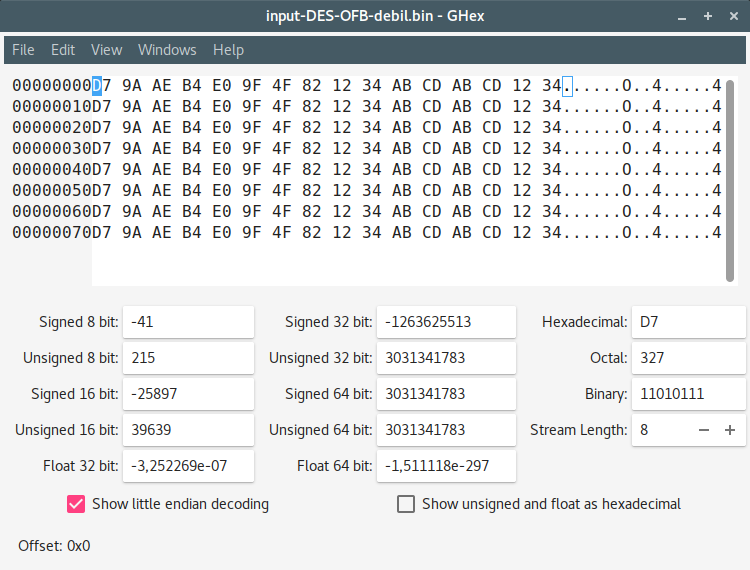

  - ***Modo OFB con clave semidébil:***

  `openssl enc -des-ofb -in input.bin -out input-DES-OFB-semidebil.bin -K E001E001F101F101 -iv 1234ABCDABCD1234 -nopad`

  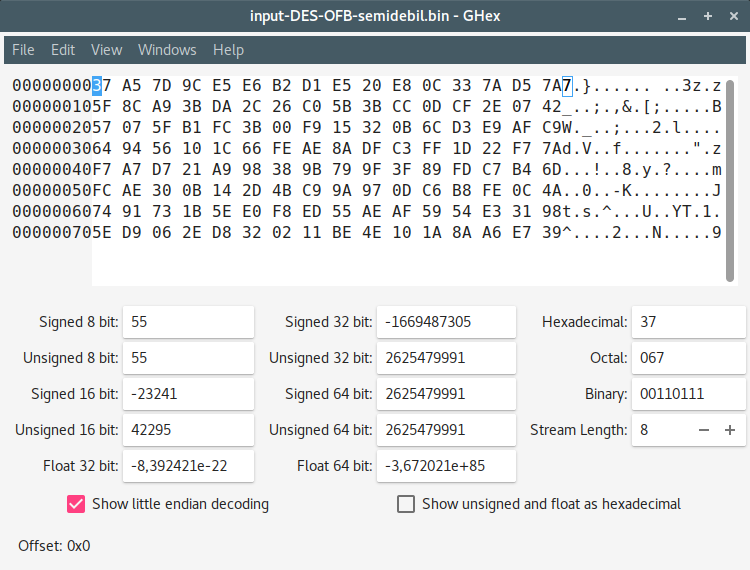

OFB sigue la misma estrategia de operaciones `XOR` pero generando **bloques de flujo de claves** y aplicando dicha operación a estos bloques. Sin embargo, al utilizar claves débiles y semidébiles (cuyas consecuencias ya conocemos) se mantiene la misma distribución que con CBC.

### 4. Cifrad input.bin e input1.bin con DES en modo ECB y clave a elegir, pero no débil ni semidébil. Explicad la forma de los resultados obtenidos.

La clave a elegir la entenderemos por "fuerte", y será la explicada en las consideraciones iniciales.

  - ***input.bin en modo ECB con clave fuerte:***

  `openssl enc -des-ecb -in input.bin -out input-DES-ECB-fuerte.bin -K 13804373ABAB43FE -nopad`

  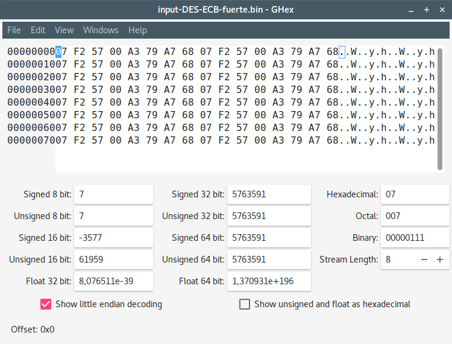

  - ***input1.bin en modo ECB con clave fuerte:***

  `openssl enc -des-ecb -in input1.bin -out input1-DES-ECB-fuerte.bin -K 13804373ABAB43FE -nopad`

  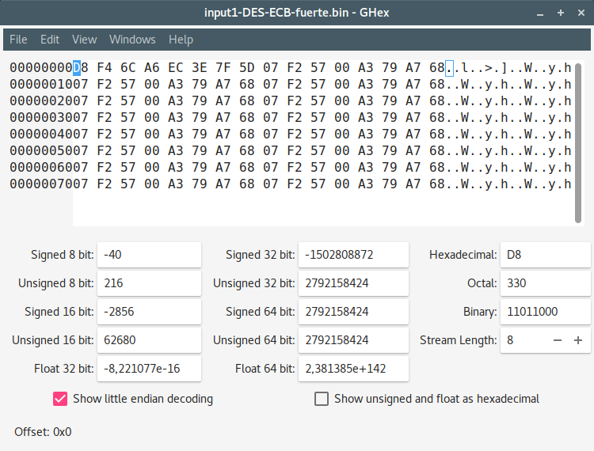

Para el archivo `input.bin` seguimos la misma progresión vista antes, ya que se repite el mismo patrón por todo el archivo (debido a los ceros contenido en **todo** el archivo). Sin embargo, en el binario `input1.bin` notamos el primer cambio; ya que el dígito `1` que añadimos dentro de los primeros 40 bits provoca la distorsión de todo el primer bloque, cuyo contenido no coincide con ningún otro, mientras que el resto repiten su contenido igual que en `input.bin`.

### 5. Cifrad input.bin e input1.bin con DES en modo CBC, clave y vector de inicialización a elegir. Comparad con los resultados obtenidos en el apartado anterior.

Volvemos a usar los parámetros especificados previamente.

  - ***input.bin en modo CBC con clave fuerte:***

  `openssl enc -des-cbc -in input.bin -out input-DES-CBC-fuerte.bin -K 13804373ABAB43FE -iv 1234ABCDABCD1234 -nopad`

  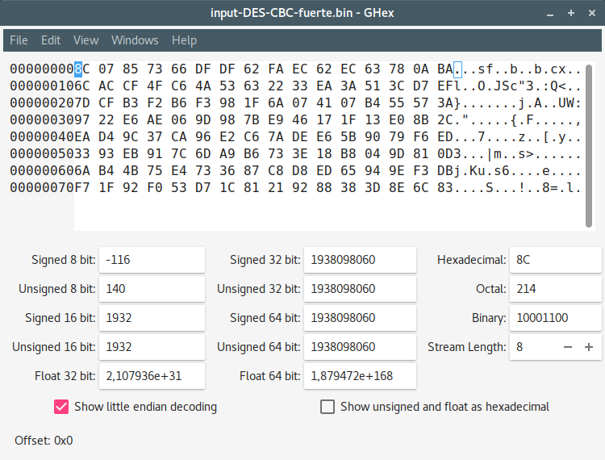

  - ***input1.bin en modo CBC con clave fuerte:***

  `openssl enc -des-cbc -in input1.bin -out input1-DES-CBC-fuerte.bin -K 13804373ABAB43FE -iv 1234ABCDABCD1234 -nopad`

  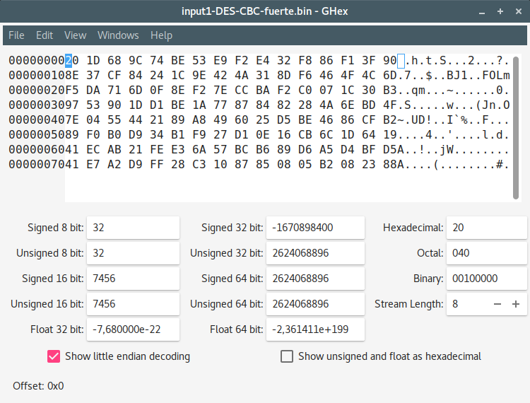

Llegados a este punto, comenzamos a apreciar realmente *la magia del cifrado*. Si comparamos `input-DES-CBC-fuerte.bin` e `input1-DES-CBC-fuerte.bin` vemos que ya no comparten ni una sola parte del texto cifrado; aun sabiendo que solo cambian 4 bits del texto plano. Esto se debe al ***cifrado en cadena*** que como sabemos realiza CBC, de forma que el primer bloque (que difiere en dichos 4 bits) afecta en su totalidad como entrada al cifrado del resto de bloques.

### 6. Repetid los puntos 4 a 5 con AES-128 y AES-256.

En este punto es cuando debemos alterar el tamaño de nuestras claves y vectores de inicialización; ya que con DES hemos estado trabajando siempre en 64 bits, pero con *AES* usaremos bloques de 128 bits para el vector de inicialización, y 128/192/256 para las claves, según el caso.

  - ***input.bin:***

    - **en modo AES-128-ECB:**

    `openssl enc -aes-128-ecb -in input.bin -out input-AES-128-ECB.bin -K 13804373ABAB43FE13804373ABAB43FE -nopad`

    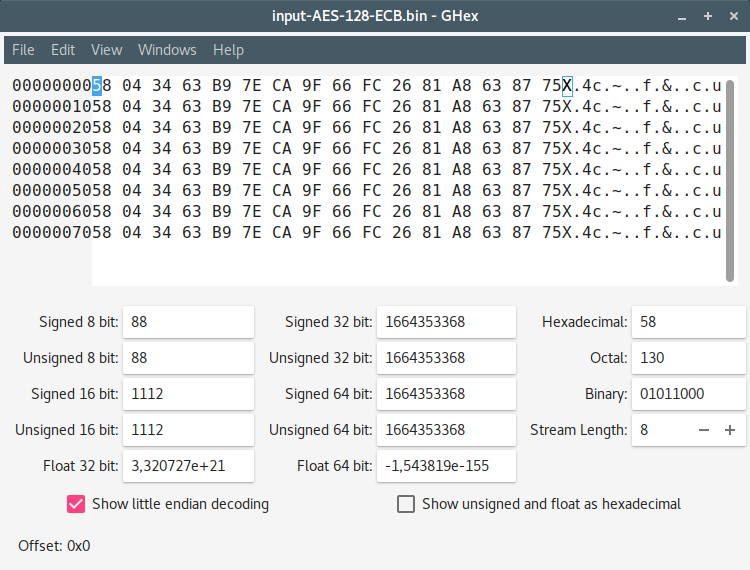

    - **en modo AES-128-CBC:**

    `openssl enc -aes-128-cbc -in input.bin -out input-AES-128-CBC.bin -K 13804373ABAB43FE13804373ABAB43FE -iv 1234ABCDABCD12341234ABCDABCD1234 -nopad`

    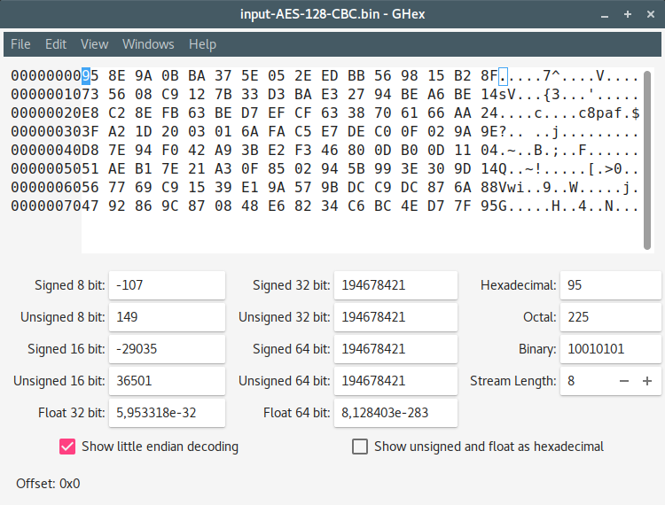

    - **en modo AES-256-ECB:**

    `openssl enc -aes-256-ecb -in input.bin -out input-AES-256-ECB.bin -K 13804373ABAB43FE13804373ABAB43FE13804373ABAB43FE13804373ABAB43FE -nopad`

    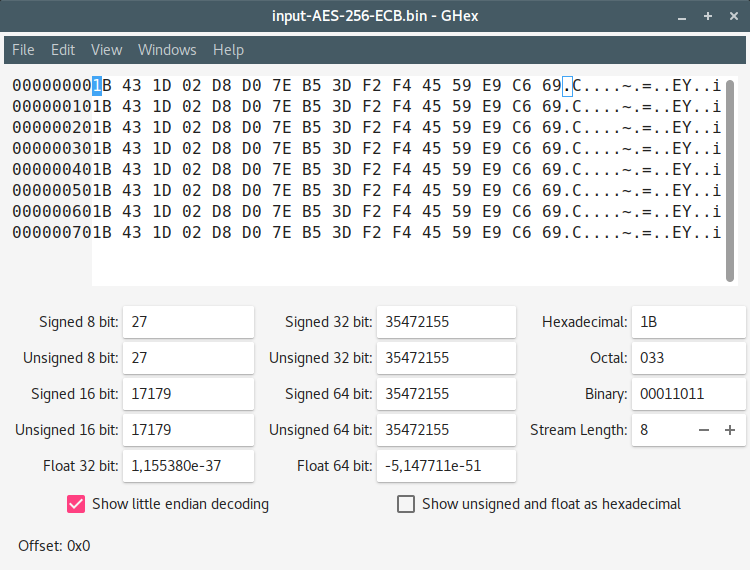

    - **en modo AES-256-CBC:**

    `openssl enc -aes-256-cbc -in input.bin -out input-AES-256-CBC.bin -K 13804373ABAB43FE13804373ABAB43FE13804373ABAB43FE13804373ABAB43FE -iv 1234ABCDABCD12341234ABCDABCD1234 -nopad`

    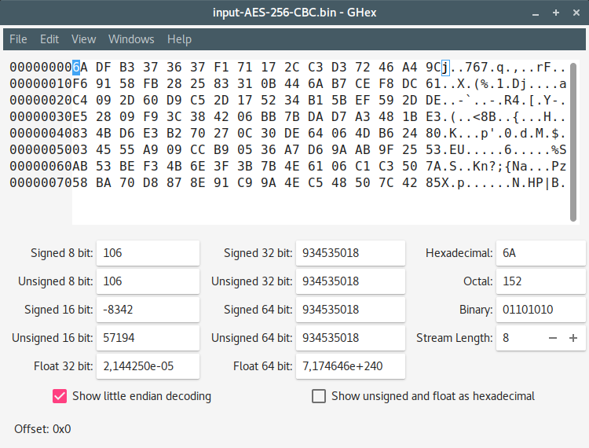

  - ***input1.bin:***

    - **en modo AES-128-ECB:**

    `openssl enc -aes-128-ecb -in input1.bin -out input1-AES-128-ECB.bin -K 13804373ABAB43FE13804373ABAB43FE -nopad`

    

    - **en modo AES-128-CBC:**

    `openssl enc -aes-128-cbc -in input1.bin -out input1-AES-128-CBC.bin -K 13804373ABAB43FE13804373ABAB43FE -iv 1234ABCDABCD12341234ABCDABCD1234 -nopad`

    

    - **en modo AES-256-ECB:**

    `openssl enc -aes-256-ecb -in input1.bin -out input1-AES-256-ECB.bin -K 13804373ABAB43FE13804373ABAB43FE13804373ABAB43FE13804373ABAB43FE -nopad`

    

    - **en modo AES-256-CBC:**

    `openssl enc -aes-256-cbc -in input1.bin -out input1-AES-256-CBC.bin -K 13804373ABAB43FE13804373ABAB43FE13804373ABAB43FE13804373ABAB43FE -iv 1234ABCDABCD12341234ABCDABCD1234 -nopad`

    

##### Conclusión

AES, como criptosistema simétrico, nos otorga un comportamiento similar al obtenido con DES, pero sin la existencia de claves débiles, por la naturaleza del algoritmo.

  - Para ECB: tanto con 128 como con 256 bits para el tamaño de clave obtenemos resultados similares en cuanto a estructura. Si bien el contenido *obviamente* no es el mismo, siguen los mismos patrones de repetición según el tamaño de bloque. Para `input1.bin` como entrada volvemos a distinguir el primer bloque de cifrado en el que no se repite el contenido del resto del criptograma.

  - Por otro lado, con CBC: obtenemos un resultado mucho más *aleatorio* como se podría esperar de un buen criptosistema. Una vez más, por la naturaleza del modo de cifrado, conseguimos que la **difusión** y **confusión** no se mantengan locales a un bloque, y que al cambiar un solo bit en la entrada (`input.bin` VS `input1.bin`) se modifique en su totalidad el criptograma de salida. No observamos ningún símil entre ninguno de los 4 ficheros binarios generados.

### 7. Cifrad input.bin con AES-192 en modo OFB, clave y vector de inicialización a elegir. Supongamos que la salida es output.bin.

El comando a ejecutar es el siguiente:

`openssl enc -aes-192-ofb -in input.bin -out input-AES-192-OFB.bin -K 13804373ABAB43FE13804373ABAB43FE -iv 1234ABCDABCD12341234ABCDABCD1234 -nopad`

Ya hemos visto antes cómo funciona el modo *OFB*. El binario obtenido es el siguiente:
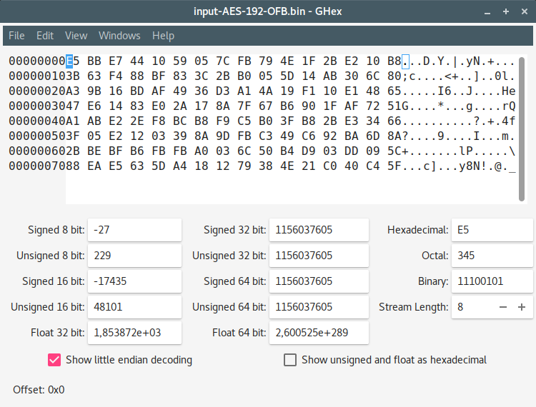

### 8. Descifra output.bin utilizando la misma clave y vector de inicialización que en 7.

Una vez realizado el paso anterior, el comando para descifrar el binario generado es el siguiente:

`openssl aes-192-ofb -d -in input-AES-192-OFB.bin -out output-AES-192-OFB.bin -K 13804373ABAB43FE13804373ABAB43FE -iv 1234ABCDABCD12341234ABCDABCD1234`

Una vez descifrado, debemos obtener un binario con el mismo contenido que el original; es decir, relleno de ceros:

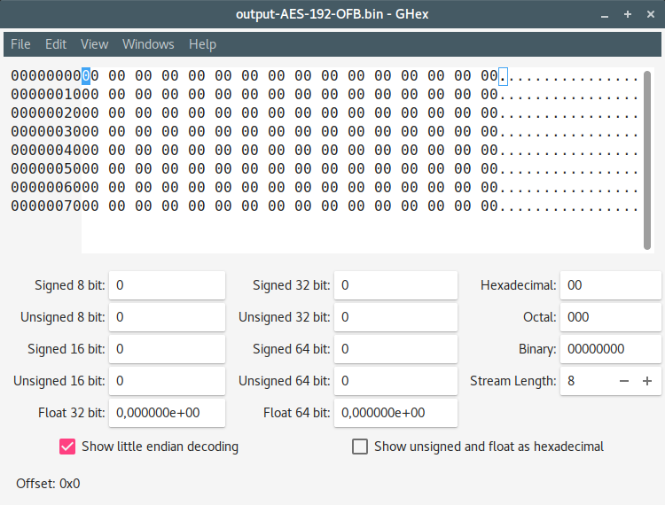

### 9. Vuelve a cifrar output.bin con AES-192 en modo OFB, clave y vector de inicialización del punto 7. Compara el resultado obtenido con el punto 8, explicando el resultado.

Repetimos el ejercicio 7 tomando como entrada el archivo de salida del ejercicio 8:

`openssl enc -aes-192-ofb -in output-AES-192-OFB.bin -out output-AES-192-OFB.9bin -K 13804373ABAB43FE13804373ABAB43FE -iv 1234ABCDABCD12341234ABCDABCD1234 -nopad
`

Y por supuesto, volvemos a obtener un binario igual que el obtenido en el ejercicio 7:
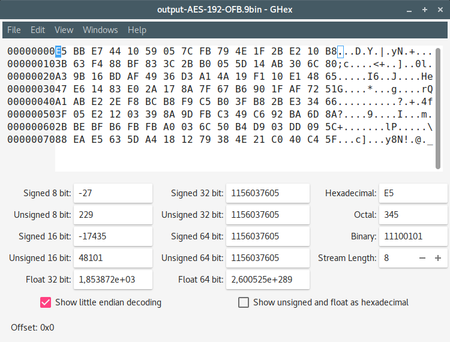

### 10. Presentad la descripción de otro cifrado simétrico que aparezca en vuestra implementación de OpenSSL.

##### Algoritmo de encriptación SEED

Podemos consultar sus características y origen [en el RFC 4009](https://tools.ietf.org/html/rfc4009). Se trata de un criptosistema simétrico desarrollado por la *KISA (Agencia de Seguridad de Información en Korea)* en 1998.

  - Tiene estructura de red de Feistel de 16 rondas.
  - Tamaño de bloques de datos de entrada/salida de 128 bits.
  - Tamaño de claves de 128 bits.
  - 2 S-cajas de 8x8.
  - Mezcla operaciones `XOR` y adiciones modulares que lo permiten mantenerse seguro y eficiente frente a los ataques más conocidos.
  - No tiene claves débiles ni semidébiles.

### 11. Repetid los puntos 3 a 5 con el cifrado presentado en el punto 10 (el 3 si el cifrado elegido tuviese claves débiles o semidébiles).

El algoritmo SEED no tiene claves débiles ni semidébiles así que nos limitaremos a repetir los ejercicios 4 y 5:

  - ***input.bin en modo ECB con clave fuerte:***

  `openssl enc -seed-ecb -in input.bin -out input-SEED-ECB.bin -K 13804373ABAB43FE -nopad`

  

  - ***input1.bin en modo ECB con clave fuerte:***

  `openssl enc -seed-ecb -in input1.bin -out input1-SEED-ECB.bin -K 13804373ABAB43FE -nopad`

  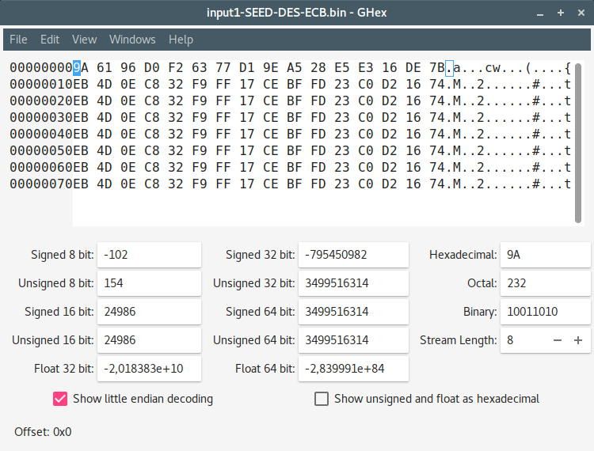

  - ***input.bin en modo CBC con clave fuerte:***

  `openssl enc -seed-cbc -in input.bin -out input-SEED-CBC.bin -K 13804373ABAB43FE -iv 1234ABCDABCD1234 -nopad`

  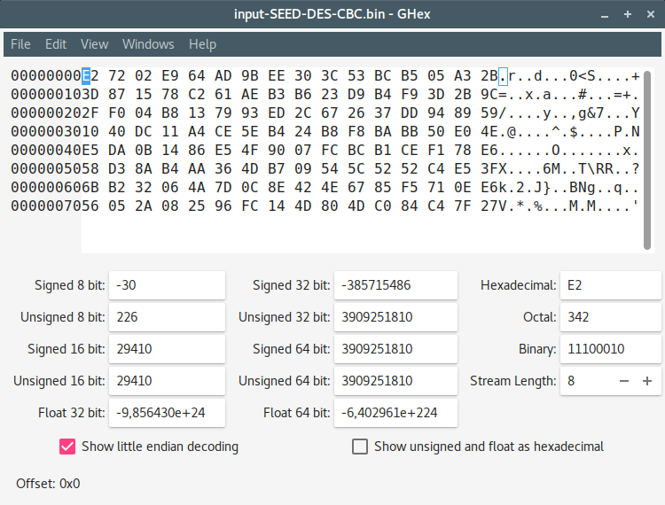

  - ***input1.bin en modo CBC con clave fuerte:***

  `openssl enc -seed-cbc -in input1.bin -out input1-SEED-CBC.bin -K 13804373ABAB43FE -iv 1234ABCDABCD1234 -nopad`

  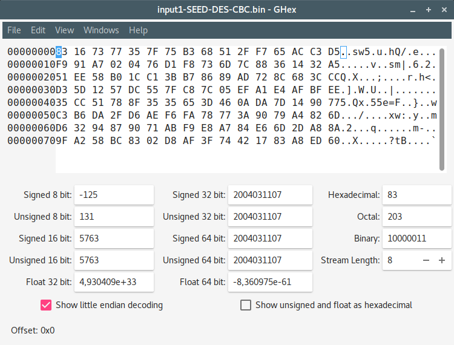

Una vez más, volvemos a apreciar el comportamiento de ECB viendo los patrones ya explicados previamente. Y por otro lado, la naturaleza de CBC que ocasiona que no haya patrones repetidos, al contrario que con el primero.
