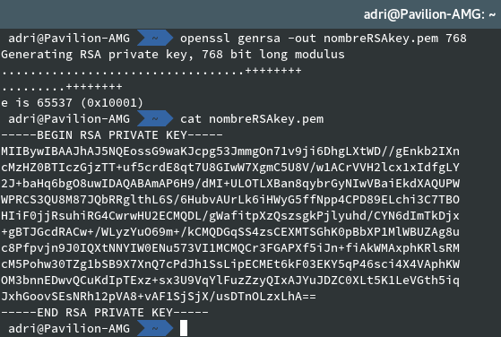
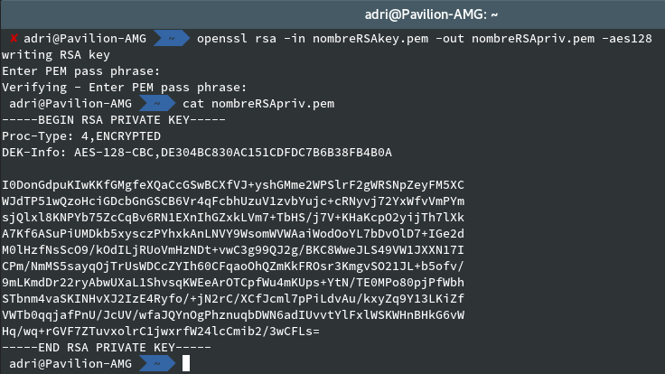
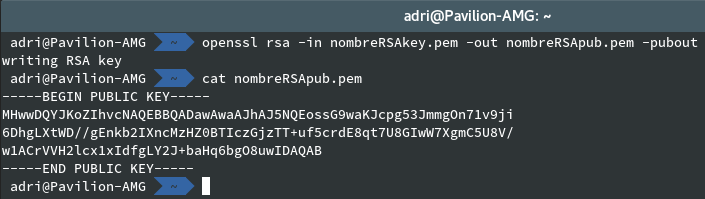
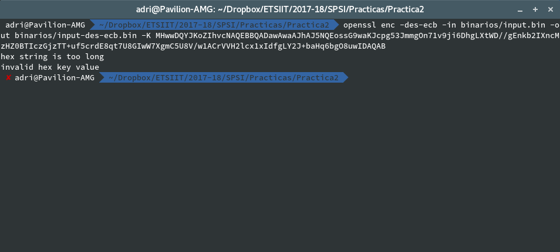

### Adrián Morente Gabaldón

# Práctica 2 - Seguridad y Protección de Sistemas Informáticos

***

***

### 1. Generad cada uno de vosotros, una clave RSA (que contiene el par de claves) de 768 bits. Para referirnos a ella supondré que se llama nombreRSAkey.pem. Esta clave no es necesario que esté protegida por contraseña.

Generamos el par de claves fácilmente con el comando `openssl genrsa`, pasando como argumentos el fichero de destino (especificado por el enunciado del ejercicio) así como el número de bits de tamaño de la clave:

  `openssl genrsa -out nombreRSAkey.pem 768`

Para este primer caso no la protegeremos con ninguna contraseña. El contenido es el siguiente:

### 2. "Extraed" la clave privada contenida en el archivo nombreRSAkey.pem a otro archivo que tenga por nombre nombreRSApriv.pem. Este archivo deberá estar protegido por contraseña cifrándolo con AES-128. Mostrad sus valores.

Una vez que la clave ha sido generada, usamos el comando `openssl rsa` para manipularla. En este caso usamos las opciones que nos permiten asignar un fichero de entrada del que obtenerla, y uno de salida con la operación aplicada:

- **-in** / **-out**: con el primero indicamos el fichero de entrada, y con el segundo el de salida.
- **-aes128**: este es el indicativo sobre qué método de cifrado aplicar al resultado con la contraseña elegida. Existen otras alternativas ya conocidas como *-des*.

El comando completo sería el siguiente, y a continuación una captura con el resultado:

`openssl rsa -in nombreRSAkey.pem -out nombreRSApriv.pem -aes128`

### 3. Extraed en nombreRSApub.pem la clave pública contenida en el archivo nombreRSAkey.pem. Evidentemente nombreRSApub.pem no debe estar cifrado ni protegido. Mostrad sus valores.

Por defecto, cuando imprimimos el contenido del archivo contenedor de nuestro **par de claves**, solo se muestra la privada. Sin embargo, la pública también está ahí, solo que tenemos que usar la opción `-pubout` para que sea mostrada. Con el siguiente comando la obtenemos del fichero de entrada y la extraemos al fichero de salida:

`openssl rsa -in nombreRSAkey.pem -out nombreRSApub.pem -pubout`

Lógicamente, una clave pública no debe ser protegida con contraseña. El valor obtenido es:

### 4. Reutilizaremos el archivo binario input.bin de 1024 bits, todos ellos con valor 0, de la práctica anterior.

Recuperamos el fichero que tenía el siguiente contenido:

### 5. Intentad cifrar input.bin con vuestra clave pública. Explicad el resultado.

Para el ejemplo, vamos a intentar cifrar el archivo input.bin con *DES* en modo *ECB*, pasando como entrada la clave pública contenida en el archivo `nombreRSApub.pem`:

`openssl enc -des-ecb -in binarios/input.bin -out binarios/input-des-ecb.bin -K XXXXXXXXX`

Sin embargo, obtenemos el siguiente error:

El error es lógico dado que el fichero input.bin tiene un tamaño de 1024 bits mientras que nuestra clave pública tan solo de 768. Si probamos con una clave de mayor tamaño

### 6. Diseñad un cifrado híbrido, con RSA como criptosistema asimétrico. El modo de proceder será el siguiente:
  1. El emisor debe seleccionar un sistema simétrico con su correspondiente modo de operación.
  2. El emisor generará un archivo de texto, llamado por ejemplo `sessionkey` con dos líneas. La primera línea contendrá una cadena aleatoria hexadecimal cuya longitud sea la requerida por la clave. OpenSSL permite generar cadenas aleatorias con el comando `openssl rand`. La segunda línea contendrá la información del criptosistema simétrico seleccionado. Por ejemplo, si hemos decidido emplear el algoritmo Blowfish en modo ECB, la segunda línea debería contener `-bf-ecb`.
  3. El archivo `sessionkey` se cifrará con la clave pública del receptor.
  4. El mensaje se cifrará utilizando el criptosistema simétrico, la clave se generará a partir del archivo anterior mediante la opción `-pass file:sessionkey`

### 7.

## Referencias

- [https://en.wikibooks.org/wiki/Cryptography/Generate_a_keypair_using_OpenSSL](https://en.wikibooks.org/wiki/Cryptography/Generate_a_keypair_using_OpenSSL)
- [https://rietta.com/blog/2012/01/27/openssl-generating-rsa-key-from-command/](https://rietta.com/blog/2012/01/27/openssl-generating-rsa-key-from-command/)
