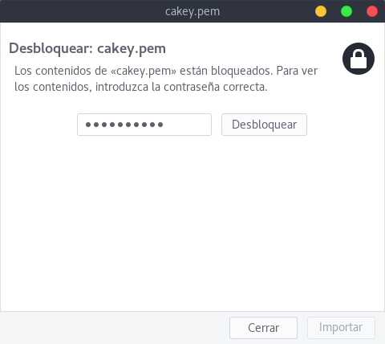
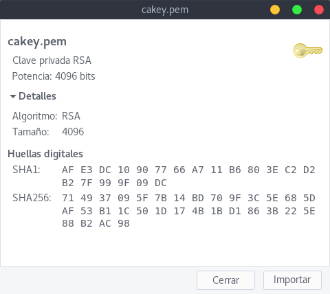
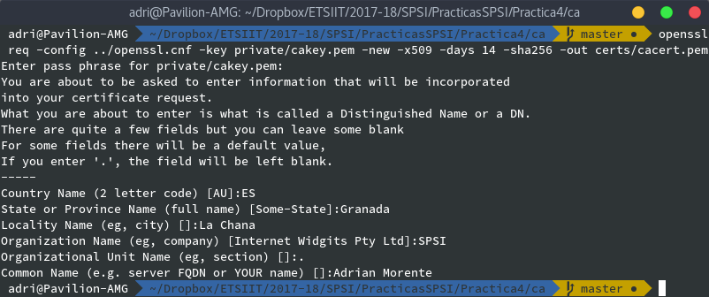
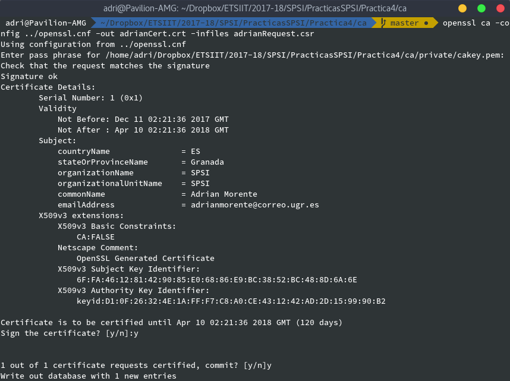
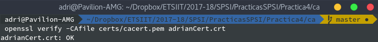

# Práctica 4 - Seguridad y Protección de Sistemas Informáticos
## CERTIFICADOS DIGITALES
### Adrián Morente Gabaldón

***

Antes de comenzar con los ejercicios, vamos a comentar algunos aspectos relevantes con respecto a la práctica, y la configuración del archivo utilizado por OpenSSL para Autoridades de Certificación.

### Comandos de utilidad para esta práctica (deben ser complementados con sus opciones pertinentes):

> - Uso y gestión de Autoridades de Certificación, así como firma de certificados:

> `$ openssl ca`

> - Solicitud de certificados a CA, con claves creadas previamente (o en el acto sobre RSA):

> `$ openssl req`

> - Manipulación de certificados previamente creados:

> `$ openssl x509`

***

Para empezar, debemos saber que la identidad de una Autoridad de Certificación se compone de dos cosas:

- **Una clave raíz** (`cakey.pem`),
- **Un certificado raíz** (`cacert.pem`).

Además, en un entorno de trabajo real no existe una sola CA raíz, sino que de ésta "cuelgan" otras CAs subordinadas, que son las que pueden firmar certificados. La autoridad raíz solo se utiliza para crear nuevas subordinadas. Cuantas menos acciones realice y menos expuesta esté, mejor; ya que si se comprometiese su clave se vería comprometido **el entorno completo**.

Sin embargo, el problema que nos ocupa solo consta de una de estas autoridades que será la raíz, y será la que utilicemos a lo largo de estos ejercicios.

***

Si ejecutamos `$ openssl ca` sin ningún parámetro nos lanza algunos errores advirtiendo que no existe ninguna Autoridad de Certificación en el sistema. Además, nos dice que la configuración cargada por el programa se encuentra bajo la ruta `/usr/lib/ssl/openssl.cnf`. Para no tener que lidiar con usuarios `root` ni trastocar la configuración inicial de OpenSSL, haremos una copia de este archivo de configuración en otro directorio (`./ca` en mi caso). En este directorio tendremos carpetas llamadas `certs`, `crl`, `newcerts` y `private`; necesarias para según qué tareas de una CA; y cuya definición se contempla en el archivo de configuración que vamos a describir.

Veamos un pequeño fragmento de su contenido (que no es poco). Para empezar, veamos la sección donde se establece el directorio principal de la CA, que por defecto es `/etc/ssl/demoCA` pero no existe. Lo lógico en un caso real sería alojar estas claves en el directorio `home` del usuario root correspondiente, pero usaremos el directorio mencionado arriba:

```
####################################################################
[ ca ]
default_ca	= CA_default		# The default ca section

####################################################################
[ CA_default ]

dir		= ./demoCA		#  - MODIFICADO *<ruta_absoluta>/ca*
```

En el directorio `dir` arriba mencionado se almacenan todos los ficheros y variables configurables. Algunas de ellas se ven a continuación, y encontramos cosas como el almacenamiento de certificados creados (en la variable `certs`), el número de serie de la CA (en `serial`), etc.:

```
certs		= $dir/certs		# Where the issued certs are kept
crl_dir		= $dir/crl		# Where the issued crl are kept
database	= $dir/index.txt	# database index file.
#unique_subject	= no			# Set to 'no' to allow creation of
					                # several ctificates with same subject.
new_certs_dir	= $dir/newcerts		# default place for new certs.

certificate	= $certs/cacert.pem 	# The CA certificate
serial		= $dir/serial 		# The current serial number
crlnumber	= $dir/crlnumber	# the current crl number
					# must be commented out to leave a V1 CRL
crl		= $dir/crl.pem 		# The current CRL
private_key	= $dir/private/cakey.pem# The private key
RANDFILE	= $dir/private/.rand	# private random number file

x509_extensions	= usr_cert		# The extentions to add to the cert

# Comment out the following two lines for the "traditional"
# (and highly broken) format.
name_opt 	= ca_default		# Subject Name options
cert_opt 	= ca_default		# Certificate field options
```

En esta otra parte podemos modificar cosas como el tiempo de expiración de los certificados expedidos, que por defecto es de 365 días y que pondré a 120 por cambiar algo. Además, podemos alterar el tiempo de revisión de la ***Lista de Revocación de Certificados*** (o *CRL*):

```
default_days	= 365			# how long to certify for - MODIFICADO A 120
default_crl_days= 30			# how long before next CRL - MODIFICADO A 15
default_md	= default		# use public key default MD
preserve	= no			# keep passed DN ordering
```

Por otro lado, también podemos (y debemos, en un caso real) modificar los parámetros pertenecientes a la política de solicitudes que debe aceptar la Autoridad de Certificación. Permite establecer políticas de restricción de firma y certificación por el país de origen del solicitante, por ejemplo.

```
# A few difference way of specifying how similar the request should look
# For type CA, the listed attributes must be the same, and the optional
# and supplied fields are just that :-)
policy		= policy_match

# For the CA policy
[ policy_match ]
countryName		= match - MODIFICADO *Spain*
stateOrProvinceName	= match - MODIFICADO *Granada*
organizationName	= match - MODIFICADO *SPSI*
organizationalUnitName	= optional - MODIFICADO *SPSI*
commonName		= supplied
emailAddress		= optional - MODIFICADO *adrianmorente@correo.ugr.es*

```

En el apartado `req` se especifican las opciones configurables a tener en cuenta al crear certificados o solicitudes de firmas. Tenemos la posibilidad de modificar parámetros como el número de bits usados en la generación de una clave, el fichero de destino para dicha clave, o las extensiones utilizadas sobre el estándar x509 (que dejaremos con valor por defecto).

```
####################################################################
[ req ]
default_bits		= 2048 - MODIFICADO *4096*
default_keyfile 	= privkey.pem
distinguished_name	= req_distinguished_name
attributes		= req_attributes
x509_extensions	= v3_ca	# The extentions to add to the self signed cert

# Passwords for private keys if not present they will be prompted for
# input_password = secret
# output_password = secret

# This sets a mask for permitted string types. There are several options.
# default: PrintableString, T61String, BMPString.
# pkix	 : PrintableString, BMPString (PKIX recommendation before 2004)
# utf8only: only UTF8Strings (PKIX recommendation after 2004).
# nombstr : PrintableString, T61String (no BMPStrings or UTF8Strings).
# MASK:XXXX a literal mask value.
# WARNING: ancient versions of Netscape crash on BMPStrings or UTF8Strings.
string_mask = utf8only

# req_extensions = v3_req # The extensions to add to a certificate request
```

Por otro lado, en la sección `[req_distinguished_name]` declaramos la información requerida para una petición de firma de certificado (esto es, el mensaje impreso en la terminal cuando realizamos una solicitud).

```
[ req_distinguished_name ]
countryName			= Country Name (2 letter code)
countryName_default		= AU
countryName_min			= 2
countryName_max			= 2

stateOrProvinceName		= State or Province Name (full name)
stateOrProvinceName_default	= Some-State

localityName			= Locality Name (eg, city)
```

Existen otros apartados y secciones como `[ usr_cert ]` y `[ server_cert ]`, que se aplican a la firma de certificados de cliente y servidor, respectivamente. Existen otras secciones menos relevantes o de menos utilidad para nuestro caso, así que las obviaremos.

***

### 1. Crear una autoridad certificadora. En este caso se premiará el uso de `openssl ca` frente a `CA.pl`, aunque este último comando es admisible.

Una vez que hemos ajustado los parámetros de configuración deseados, si queremos crear la Autoridad de Certificación necesitamos las dos partes antes mencionadas, la clave raíz y el certificado raíz.

##### 1.1. **Clave raíz**:

Dentro del directorio creado al efecto (o en `/root/ca` en un caso real), ejecutamos la orden ya conocida para generar una clave, fijando como destino el directorio `/private`. Esto es obvio ya que esta clave se utilizará para emitir certificados confiables, por lo que **nadie** debe tener acceso a ella:

```
$ openssl genrsa -aes256 -out private/cakey.pem 4096
```

Protegemos el archivo `cakey.pem` con la contraseña `0123456789` usando AES256 y con una longitud de 4096 bytes.



##### 1.2. **Certificado raíz**:

Una vez que tenemos la clave raíz, podemos usarla para crear el certificado raíz, que será un **certificado autofirmado**. Los parámetros de entrada al comando serán varios, en los que definimos (en este orden) el fichero de configuración, la clave raíz, el estándar seguido por el certificado (x509), los días de validez y el fichero de salida.

> En cuanto a la fecha de expiración, voy a usar 14 días porque se trata de una simulación sin efecto práctico. Pero en un caso real debería ser del orden de años; dado que una vez que expire este certificado raíz, todos los demás emitidos por la CA dejarán de tener validez alguna.

```
$ openssl req -config openssl.cnf -key private/cakey.pem -new -x509
		-days 14 -sha256 -out certs/cacert.pem
```

En cuanto ejecutamos el comando, se nos realizarán varias preguntas (las definidas en el fichero de configuración vistas con anterioridad) que deberemos cumplimentar para la creación del certificado autofirmado.



Podemos ver el contenido del certificado generado con el siguiente comando:

```
$ openssl x509 -in certs/cacert.pem -noout -text

Certificate:
    Data:
        Version: 3 (0x2)
        Serial Number: 18366749423416709384 (0xfee3cd4a155d1108)
    Signature Algorithm: sha256WithRSAEncryption
        Issuer: C=ES, ST=Granada, L=La Chana, O=SPSI, CN=Adrian Morente/
				emailAddress=adrianmorente@correo.ugr.es
        Validity
            Not Before: Dec 11 01:17:48 2017 GMT
            Not After : Dec 25 01:17:48 2017 GMT
        Subject: C=ES, ST=Granada, L=La Chana, O=SPSI, CN=Adrian Morente/
				emailAddress=adrianmorente@correo.ugr.es
        Subject Public Key Info:
            Public Key Algorithm: rsaEncryption
                Public-Key: (4096 bit)
                Modulus:
                    00:bc:40:9c:e1:b4:c1:ce:39:1d:9b:e8:c7:0b:a3:
                    25:09:2e:24:31:50:5f:72:03:77:af:0f:17:b6:a1:
                    16:26:07:ba:3c:cc:a8:37:4a:e5:7b:6d:28:96:93:
                    f3:31:fd:67:c9:31:81:14:0d:a3:32:f2:40:2c:ff:
                    58:72:92:00:55:fb:5a:0a:15:3a:f8:cc:0d:cb:27:
                    a4:00:b6:55:6e:95:01:46:bf:5e:2b:1e:cc:47:72:
                    31:8b:bb:01:47:1f:05:81:82:d2:82:f0:00:aa:e3:
                    27:06:f3:24:3a:02:f9:83:ce:86:29:90:15:71:f6:
                    23:cf:73:4b:75:b6:73:ae:5a:2f:0b:6e:89:88:4b:
                    37:6a:5e:14:74:b5:0b:4d:e2:0e:8c:aa:73:7f:4a:
                    50:45:dc:19:88:34:dc:97:eb:ac:89:56:14:f7:4e:
                    ea:55:ff:2e:3b:63:8a:66:82:8a:e5:70:28:fd:22:
                    f3:b8:a1:7c:73:66:76:c6:0d:28:99:ec:0c:c0:08:
                    52:8a:39:5e:31:32:a1:06:5a:a7:b3:47:bd:b8:74:
                    e4:a9:bb:60:53:65:19:04:ca:3f:1d:4d:3c:c2:d9:
                    e1:fa:76:eb:91:9c:e9:bc:7d:94:f4:89:cf:f1:ba:
                    63:68:4f:86:10:9a:e6:2b:6e:a2:0a:4a:9e:b9:6c:
                    a5:3a:7d:88:bb:c2:52:76:05:11:fa:fb:b3:26:be:
                    19:8b:f7:dd:1a:aa:d9:31:90:34:1e:f4:07:cc:f6:
                    a6:ab:84:70:3b:da:5c:93:ce:7f:b5:5b:e3:7c:1b:
                    9b:10:6f:96:76:f9:df:c5:bb:c5:f4:63:8a:ca:88:
                    91:58:ec:a9:0b:a9:f9:b7:6a:75:89:c6:4f:08:fe:
                    38:70:cb:f9:a0:c6:80:45:db:a8:2b:b4:74:8d:40:
                    97:0a:20:3c:21:d3:05:53:8f:53:29:5e:74:ea:ea:
                    06:a0:73:76:a1:a3:d7:ab:97:28:17:ab:bd:07:a0:
                    91:90:b8:43:df:bf:c3:2b:49:48:21:fa:ef:31:7d:
                    19:79:6c:db:2e:2f:db:98:2a:63:af:30:88:06:bb:
                    cd:ba:bc:6d:cf:d7:f2:30:a7:96:26:c1:db:dc:8d:
                    da:9d:31:3b:01:6c:48:47:cb:55:88:3f:a8:d9:d0:
                    e7:68:9b:af:65:bb:4f:d3:13:0b:52:c4:a8:bd:95:
                    9e:bd:f7:e5:6f:5c:2c:5f:6a:fa:ee:f0:da:1f:67:
                    28:66:59:b6:71:9a:83:74:82:6f:e3:98:c6:d1:c3:
                    d5:57:87:c8:98:36:25:ad:46:ec:f0:f3:8f:e6:d4:
                    f3:62:61:e2:c9:c6:49:ac:fd:dd:1d:42:5c:a5:bf:
                    42:76:67
                Exponent: 65537 (0x10001)
        X509v3 extensions:
            X509v3 Subject Key Identifier:
                D1:0F:26:32:4E:1A:FF:F7:C8:A0:CE:43:12:42:AD:2D:15:99:90:B2
            X509v3 Authority Key Identifier:
                keyid:D1:0F:26:32:4E:1A:FF:F7:C8:A0:CE:43:12:42:AD:2D:
								15:99:90:B2

            X509v3 Basic Constraints:
                CA:TRUE
    Signature Algorithm: sha256WithRSAEncryption
         93:d0:7b:38:2b:53:4f:66:b3:70:87:4a:36:73:94:22:44:24:
         b0:6c:cb:24:e6:43:eb:c6:1e:57:df:3b:33:42:0f:51:c5:51:
         3a:dd:d5:47:6e:e1:51:c5:46:73:84:2b:93:3a:d1:e1:02:c3:
         b7:b9:13:f6:30:90:57:f0:cf:32:c9:cf:3e:ae:50:d9:c6:cc:
         8d:71:49:80:64:d3:68:3e:da:54:1f:bb:e4:e9:d2:86:c0:86:
         40:01:c3:f1:7a:54:4e:04:16:f7:26:40:19:e5:37:e3:fc:d9:
         a9:f8:c1:2e:c2:d4:04:15:cb:6b:6d:6d:20:b9:98:86:7d:19:
         16:7f:e8:cc:13:ac:13:9e:ab:79:d6:55:df:4b:62:5b:cb:6f:
         cc:83:a1:d5:f1:d6:5e:4f:ee:f0:98:0f:22:66:28:6f:d0:ff:
         f6:ab:f0:c3:8c:11:cb:2b:97:1f:82:1f:fd:ad:f8:c3:1b:19:
         cb:cf:97:0a:d1:9d:47:a7:ef:7f:3d:87:e3:da:9e:97:ce:9e:
         b9:27:e5:40:4c:88:c2:63:b0:cb:89:72:b2:38:9e:4a:a8:cb:
         d3:74:38:2a:2d:d9:ff:7f:fc:6c:76:5b:ff:dd:cd:d6:cd:08:
         9a:de:78:1e:27:0e:df:f1:e0:aa:2a:92:93:f6:51:74:45:c5:
         48:03:2d:70:c5:13:92:05:ee:24:12:ac:f5:8c:01:40:ad:f5:
         ee:be:e2:97:e5:7b:80:00:6c:fc:a6:a7:0b:39:72:2e:19:0e:
         b4:b8:fa:ba:8a:18:21:0c:b2:f3:19:9f:d3:c4:47:56:4a:5d:
         3a:54:86:31:3e:69:65:26:57:a4:aa:6e:08:7c:d3:91:b8:fc:
         fe:7d:e0:75:07:0b:2d:52:c0:04:dd:30:ec:45:ee:04:11:9f:
         a7:5e:ad:96:fc:96:77:2d:14:63:25:d4:ef:9f:30:cc:ef:7c:
         f5:9f:27:f4:27:ea:ee:43:8a:68:71:90:30:67:b4:55:93:72:
         97:f3:f7:30:11:82:d2:ea:b5:cd:fb:c0:05:ba:52:45:a4:d2:
         6a:91:4e:48:d4:06:cd:53:db:5d:2c:3d:16:1d:25:1d:26:50:
         2b:c6:6f:43:b4:db:63:87:3d:47:a3:c9:14:38:72:53:0b:8e:
         89:7c:65:ab:96:2a:03:e2:73:bb:d1:ea:02:31:2b:0d:43:7a:
         05:20:0d:5c:e3:1f:7f:5e:0b:77:91:b7:3c:f8:70:1e:30:06:
         49:4e:8b:f0:8a:d8:d7:2f:62:d3:e5:52:5a:ba:9c:39:f6:b1:
         e8:e0:7c:f9:6d:39:19:2b:64:86:5a:b8:de:7b:b2:df:28:c1:
         38:4e:4c:80:73:b9:c0:1f
```

***

### 2. Cread una solicitud de certificado que incluya la generación de claves en la misma.

En este caso, en vez de realizar un certificado autofirmado estaremos solicitando un certificado para una clave que no corresponde a la CA; por lo que la clave usada será diferente lógicamente.

Esta clave puede ser generada sobre la marcha con las opciones `-newkey` y `-keyout <destino>`. Además, con `rsa:4096` estamos especificando cómo queremos que sea dicha clave. Podemos protegerla con contraseña o no para esta simulación, pero en un caso real sería deseable hacerlo. Ejecutaremos el siguiente comando, que al igual que antes, nos preguntará cosas como ubicación, nombre del solicitante, compañía, etc.:

```
$ openssl req -new -newkey rsa:4096 -keyout adrianKey.pem -out
adrianRequest.csr
```

Una vez generada la petición, podemos ver su contenido con el siguiente comando (similar a lo que venimos haciendo siempre):

```
$ openssl req -verify -in adrianRequest.csr -text -noout

verify OK
Certificate Request:
    Data:
        Version: 0 (0x0)
        Subject: C=ES, ST=Granada, L=Las Gabias, O=SPSI, OU=SPSI, CN=Adrian
				Morente/emailAddress=adrianmorente@correo.ugr.es
        Subject Public Key Info:
            Public Key Algorithm: rsaEncryption
                Public-Key: (4096 bit)
                Modulus:
                    00:bd:b8:f1:b9:38:e2:d6:a9:39:06:c2:2b:e1:f4:
                    a6:29:18:f0:e5:18:22:3d:79:a1:04:99:16:7d:22:
                    fd:4b:59:e4:d3:34:7d:33:b8:ed:c2:7f:7f:16:10:
                    e6:0e:14:1d:7c:98:58:46:cc:07:e6:36:12:1a:05:
                    2c:a8:86:e1:f9:71:2e:1d:45:7f:5a:35:9e:02:31:
                    d1:c0:43:f2:de:d8:9a:f1:02:15:30:59:3c:c3:4d:
                    f0:eb:f9:7f:f6:73:cf:b0:ce:e9:54:28:42:f5:1d:
                    78:80:57:11:6a:ef:fa:12:46:63:da:26:f1:6b:d8:
                    2f:83:db:b8:16:6a:e8:b3:dd:15:6a:8e:0a:48:53:
                    ab:b5:54:ce:58:94:ea:1f:70:31:93:72:7f:69:20:
                    08:c1:33:a3:50:b5:0a:52:90:51:9f:22:bd:25:0c:
                    91:aa:14:42:01:a2:d4:78:50:29:73:bc:00:4e:12:
                    4f:75:0c:38:ed:3e:6c:af:b2:fe:f2:b2:76:d4:66:
                    4c:7e:33:01:4a:0b:95:d3:49:0a:10:cc:65:cb:37:
                    55:8f:3e:62:52:ec:9d:7b:33:a9:3f:7b:70:30:36:
                    e4:3c:0f:f7:6b:da:42:2b:d2:dd:b5:d7:cf:8e:de:
                    ee:f0:12:b6:99:07:99:a5:3c:41:ad:22:41:ca:5f:
                    6b:e3:3f:54:46:2f:d4:54:34:e5:a4:bd:77:22:0d:
                    49:89:69:7c:59:15:6c:7c:ec:b6:2e:b0:e8:0e:c1:
                    1a:c7:9f:35:4e:db:87:50:39:43:97:66:c2:c5:e0:
                    f8:42:66:b7:2f:fd:0b:59:8c:70:6d:f9:0b:11:0c:
                    b5:49:7d:59:1e:28:25:7a:0a:e2:77:a6:bb:a3:2c:
                    2d:dd:57:29:86:fa:81:1c:15:ed:90:c4:4b:f9:3d:
                    2e:c5:4c:26:ce:ad:14:cd:a4:2a:86:d7:d5:bb:d1:
                    2d:dd:32:e4:80:a4:7a:c4:0e:ec:fb:cc:bb:3c:c5:
                    30:c7:7b:4a:f4:eb:e6:8a:1f:e6:52:31:70:5c:00:
                    6d:42:60:1c:fc:db:0e:68:fd:82:26:e8:c1:af:c8:
                    d3:b4:e0:1b:99:45:96:e6:72:7a:b7:f4:eb:ee:dd:
                    6f:57:4a:c4:2c:97:12:a7:92:de:04:ab:18:03:7d:
                    57:80:11:c5:07:97:fa:dc:3f:cc:dd:1b:fe:25:95:
                    b9:93:6d:22:0e:18:79:b6:03:31:ea:94:a2:90:2c:
                    fc:bf:b7:e3:62:9f:51:cd:cd:ee:b2:16:02:c9:fd:
                    ba:68:76:0b:82:b8:46:b8:08:ea:25:60:7e:3e:93:
                    6b:16:79:18:de:b5:d8:7b:60:69:8d:fd:69:84:77:
                    a9:29:15
                Exponent: 65537 (0x10001)
        Attributes:
            a0:00
    Signature Algorithm: sha256WithRSAEncryption
         9f:64:65:b0:64:66:3a:87:6b:fe:3a:1f:5a:45:bc:69:0b:99:
         61:d2:0a:a3:a3:a6:a9:37:8a:1d:16:6e:40:6b:f5:93:45:2d:
         a5:22:39:54:79:a3:74:d9:d6:a2:e1:79:6d:66:e9:12:7d:2a:
         8b:06:84:3d:d6:af:0a:3e:92:70:4d:d4:1d:2b:f6:02:24:cc:
         d8:72:17:9a:f3:e3:16:c5:16:54:82:53:43:14:1e:92:df:7f:
         2d:98:88:67:6b:f2:c2:4e:39:ba:f5:b0:06:f8:70:89:ac:83:
         a3:0a:5e:fc:f0:a2:29:49:93:18:6f:1c:66:4e:2c:3a:51:ce:
         c2:24:a4:96:47:ad:5c:74:b3:03:ab:ca:14:7e:53:ec:aa:61:
         89:75:79:c5:c1:66:29:a9:7d:b7:66:14:e7:43:97:37:42:c7:
         d8:63:d1:d1:99:0f:56:28:8b:98:44:9b:da:34:9e:4d:1f:a0:
         19:f7:1a:c4:eb:c4:59:55:8e:31:72:56:1c:df:3e:d3:ee:4f:
         54:53:48:01:42:98:42:fc:bd:74:8e:71:fc:84:a6:7f:a3:8d:
         3d:47:9b:eb:5b:d8:8d:bb:80:88:94:ec:c0:0d:62:fb:eb:77:
         8f:ac:ad:0d:39:04:e9:5d:a6:de:8b:2a:85:79:2d:58:4e:fe:
         71:76:c5:04:fb:00:b9:84:ca:7a:99:ca:ad:97:53:4d:be:80:
         e6:f4:f0:ad:ad:42:97:a5:26:16:08:39:29:bc:57:7a:45:4a:
         66:b8:e6:5a:a5:65:a3:79:ac:ff:20:50:48:d2:0d:55:4e:df:
         77:74:fd:86:6f:a5:11:16:ed:ea:18:7e:01:c2:e8:e2:19:5d:
         af:c9:6d:3f:59:03:5b:9e:e4:4e:b5:cb:c7:91:8b:a7:7f:40:
         51:a7:6a:38:f9:8d:54:8a:c8:8f:14:c0:7c:31:5f:2a:1f:95:
         27:74:22:25:bf:41:cb:8f:b7:3e:57:91:bf:b9:35:d6:1f:9d:
         9d:1f:6a:80:5c:65:4f:1e:cc:b9:66:04:9b:75:94:c5:b7:38:
         a8:ff:f8:72:c2:15:11:00:e3:03:f1:63:82:ab:0f:e1:eb:dd:
         e6:5f:02:1f:6b:b5:bd:b6:40:91:e6:02:9a:33:72:73:33:08:
         55:fe:6d:3b:3f:85:ac:00:d7:b8:c9:b1:6e:79:85:f9:27:12:
         88:7c:3d:f6:f5:e1:33:50:60:57:14:e8:0c:46:b6:0e:8b:b5:
         3d:32:4b:f7:ba:7f:7f:9f:3e:b6:ed:c8:ee:f0:70:73:f7:01:
         ba:e8:0c:1d:cc:96:de:c7:ba:b2:6f:ab:da:a8:06:22:26:f6:
         45:63:c7:4a:a8:83:bb:48
```

El fragmento `verify OK` nos confirma que la petición se ha realizado con éxito.

***

### 3. Cread un certificado para la solicitud anterior empleando la CA creada en el primer punto.

Una vez hecha la petición, podemos utilizar la configuración realizada antes de los ejercicios para `openssl ca` y firmar los certificados solicitados. Insisto, esto no lo haría la CA raíz sino una de sus subordinadas, pero en este caso lo haremos así. Utilizaremos el siguiente comando, que tiene un cuenta dicha configuración, el fichero de destino para el certificado del solicitante y la solicitud correspondiente.

```
$ openssl ca -config ../openssl.cnf -out adrianCert.crt -infiles
adrianRequest.csr
```

Una vez ejecutado, verifica el contenido de la petición, comprueba que coincide la clave del solicitante y, si no hay ningún problema, retorna una pantalla similar a la siguiente:



Por otro lado, para ver el contenido del nuevo certificado hacemos lo siguiente:

```
$ openssl x509 -in adrianCert.crt -noout -text

Certificate:
    Data:
        Version: 3 (0x2)
        Serial Number: 1 (0x1)
    Signature Algorithm: sha256WithRSAEncryption
        Issuer: C=ES, ST=Granada, L=La Chana, O=SPSI, CN=Adrian Morente/
				emailAddress=adrianmorente@correo.ugr.es
        Validity
            Not Before: Dec 11 02:21:36 2017 GMT
            Not After : Apr 10 02:21:36 2018 GMT
        Subject: C=ES, ST=Granada, O=SPSI, OU=SPSI, CN=Adrian Morente/
				emailAddress=adrianmorente@correo.ugr.es
        Subject Public Key Info:
            Public Key Algorithm: rsaEncryption
                Public-Key: (4096 bit)
                Modulus:
                    00:bd:b8:f1:b9:38:e2:d6:a9:39:06:c2:2b:e1:f4:
                    a6:29:18:f0:e5:18:22:3d:79:a1:04:99:16:7d:22:
                    fd:4b:59:e4:d3:34:7d:33:b8:ed:c2:7f:7f:16:10:
                    e6:0e:14:1d:7c:98:58:46:cc:07:e6:36:12:1a:05:
                    2c:a8:86:e1:f9:71:2e:1d:45:7f:5a:35:9e:02:31:
                    d1:c0:43:f2:de:d8:9a:f1:02:15:30:59:3c:c3:4d:
                    f0:eb:f9:7f:f6:73:cf:b0:ce:e9:54:28:42:f5:1d:
                    78:80:57:11:6a:ef:fa:12:46:63:da:26:f1:6b:d8:
                    2f:83:db:b8:16:6a:e8:b3:dd:15:6a:8e:0a:48:53:
                    ab:b5:54:ce:58:94:ea:1f:70:31:93:72:7f:69:20:
                    08:c1:33:a3:50:b5:0a:52:90:51:9f:22:bd:25:0c:
                    91:aa:14:42:01:a2:d4:78:50:29:73:bc:00:4e:12:
                    4f:75:0c:38:ed:3e:6c:af:b2:fe:f2:b2:76:d4:66:
                    4c:7e:33:01:4a:0b:95:d3:49:0a:10:cc:65:cb:37:
                    55:8f:3e:62:52:ec:9d:7b:33:a9:3f:7b:70:30:36:
                    e4:3c:0f:f7:6b:da:42:2b:d2:dd:b5:d7:cf:8e:de:
                    ee:f0:12:b6:99:07:99:a5:3c:41:ad:22:41:ca:5f:
                    6b:e3:3f:54:46:2f:d4:54:34:e5:a4:bd:77:22:0d:
                    49:89:69:7c:59:15:6c:7c:ec:b6:2e:b0:e8:0e:c1:
                    1a:c7:9f:35:4e:db:87:50:39:43:97:66:c2:c5:e0:
                    f8:42:66:b7:2f:fd:0b:59:8c:70:6d:f9:0b:11:0c:
                    b5:49:7d:59:1e:28:25:7a:0a:e2:77:a6:bb:a3:2c:
                    2d:dd:57:29:86:fa:81:1c:15:ed:90:c4:4b:f9:3d:
                    2e:c5:4c:26:ce:ad:14:cd:a4:2a:86:d7:d5:bb:d1:
                    2d:dd:32:e4:80:a4:7a:c4:0e:ec:fb:cc:bb:3c:c5:
                    30:c7:7b:4a:f4:eb:e6:8a:1f:e6:52:31:70:5c:00:
                    6d:42:60:1c:fc:db:0e:68:fd:82:26:e8:c1:af:c8:
                    d3:b4:e0:1b:99:45:96:e6:72:7a:b7:f4:eb:ee:dd:
                    6f:57:4a:c4:2c:97:12:a7:92:de:04:ab:18:03:7d:
                    57:80:11:c5:07:97:fa:dc:3f:cc:dd:1b:fe:25:95:
                    b9:93:6d:22:0e:18:79:b6:03:31:ea:94:a2:90:2c:
                    fc:bf:b7:e3:62:9f:51:cd:cd:ee:b2:16:02:c9:fd:
                    ba:68:76:0b:82:b8:46:b8:08:ea:25:60:7e:3e:93:
                    6b:16:79:18:de:b5:d8:7b:60:69:8d:fd:69:84:77:
                    a9:29:15
                Exponent: 65537 (0x10001)
        X509v3 extensions:
            X509v3 Basic Constraints:
                CA:FALSE
            Netscape Comment:
                OpenSSL Generated Certificate
            X509v3 Subject Key Identifier:
                6F:FA:46:12:81:42:90:85:E0:68:86:E9:BC:38:52:BC:48:8D:6A:6E
            X509v3 Authority Key Identifier:
                keyid:D1:0F:26:32:4E:1A:FF:F7:C8:A0:CE:43:12:42:AD:2D:
								15:99:90:B2

    Signature Algorithm: sha256WithRSAEncryption
         a3:f7:f8:63:c7:94:b4:5d:c6:49:cd:18:21:d8:40:8c:32:ce:
         b1:4f:fb:02:14:e5:56:f6:0a:c3:c8:05:9d:7f:cc:db:82:a5:
         68:9b:49:e5:06:1f:3d:55:01:7a:c9:19:29:4f:ca:0a:09:73:
         9e:b0:41:a6:31:2f:94:91:dd:2c:27:f2:dd:40:c1:26:b7:a7:
         95:6c:a4:58:a9:98:7c:e7:7f:de:b3:f9:94:60:5d:4c:d2:d9:
         5f:86:91:0d:a3:6a:87:c3:ba:cd:a9:1f:25:c7:08:09:37:4d:
         0e:f9:f5:6c:16:c4:c8:ee:a7:55:97:f5:fd:00:03:72:1a:41:
         49:ae:84:4d:8d:7b:d7:76:14:60:7e:75:1b:48:2b:cd:f2:64:
         44:7a:0b:75:dd:5e:5f:9a:a0:aa:d9:cf:f7:38:e9:56:cc:d9:
         f5:87:83:0d:ab:35:b3:0b:f5:5f:c0:55:6f:2e:c9:a4:4d:a3:
         a9:03:8f:99:1c:9a:81:0c:73:97:38:05:03:ef:4c:a0:f1:af:
         10:0a:9e:f4:41:28:29:90:a3:bf:7b:40:e4:38:f1:e6:54:36:
         03:1b:23:bf:33:fd:08:bf:ac:b9:e7:7f:71:10:cd:48:72:1e:
         36:ee:9f:15:3e:e5:5d:af:1b:97:bb:4b:a5:c7:27:2d:ad:77:
         79:d7:9b:51:c5:2e:0a:c4:33:bb:bb:8f:a7:09:55:76:65:d1:
         c2:bf:95:83:ca:56:f7:fd:33:b9:2b:4e:b9:87:ad:a8:71:1c:
         6e:3d:63:cc:a2:ef:0d:11:17:5a:b5:70:b8:a5:09:12:93:d4:
         e4:e4:90:2e:71:6d:00:78:e0:67:33:18:7c:3f:e4:48:d5:58:
         70:93:87:7f:54:c5:90:e6:4a:1b:70:dc:14:18:9b:f5:14:7c:
         6d:33:0b:77:d5:68:1a:d9:42:2d:a7:bc:e5:30:aa:15:04:0f:
         9d:64:d3:14:d4:6f:0b:c4:8e:9e:c0:74:aa:6e:2f:22:b6:56:
         21:78:c9:84:ea:6d:e2:72:4e:67:ee:64:f6:91:7f:0d:b3:d7:
         4a:c1:23:fe:c4:7e:1b:ae:37:79:cf:ef:5d:23:a6:bd:c3:d7:
         38:ac:1a:fb:bc:1d:b0:64:77:c2:84:91:fc:0e:67:0e:8b:05:
         d7:c9:9d:4c:89:86:e8:aa:2e:7a:3d:63:1b:d7:99:1d:26:37:
         6e:86:e8:4e:b7:72:52:63:a7:a4:89:f6:63:46:47:35:f0:a0:
         d8:39:1f:c6:b2:89:ed:25:6a:e8:79:69:6b:f1:5a:02:9a:4f:
         12:c9:93:5a:64:79:60:e1:5f:6b:0c:3a:c5:44:17:98:7e:b6:
         6f:cd:ac:96:f5:fd:6e:26

```

Si queremos verificar que el nuevo certificado generado para el solicitante es consistente y no genera problemas de verificación entre éste y la CA, podemos comprobarlo con el siguiente comando:

```
$ openssl verify -CAfile certs/cacert.pem adrianCert.crt
```



***

### 4. Cread una solicitud de certificado para cualquiera de las claves que habéis generado en las prácticas anteriores, excepto las RSA.

Voy a usar el archivo `adrianDSAkey.pem` generado en la Práctica 3. El comando a ejecutar sería una modificación del correspondiente al ejercicio 2, con la modificación del fichero a utilizar en lugar de generar una clave nueva.

```
$ openssl req -new -key adrianDSAkey.pem -out adrianDSARequest.csr

You are about to be asked to enter information that will be incorporated
into your certificate request.
What you are about to enter is what is called a Distinguished Name or a DN.
There are quite a few fields but you can leave some blank
For some fields there will be a default value,
If you enter '.', the field will be left blank.
-----
Country Name (2 letter code) [AU]:ES
State or Province Name (full name) [Some-State]:Granada
Locality Name (eg, city) []:La Chana
Organization Name (eg, company) [Internet Widgits Pty Ltd]:SPSI
Organizational Unit Name (eg, section) []:SPSI
Common Name (e.g. server FQDN or YOUR name) []:Adrian Morente
Email Address []:adrianmorente@correo.ugr.es

Please enter the following 'extra' attributes
to be sent with your certificate request
A challenge password []:
An optional company name []:
```

Para visualizar el contenido de la petición, ejecutamos otra vez el comando:

```
$ openssl req -verify -in adrianDSARequest.csr -text -noout

verify OK
Certificate Request:
    Data:
        Version: 0 (0x0)
        Subject: C=ES, ST=Granada, L=La Chana, O=SPSI, OU=SPSI, CN=Adrian
				Morente/emailAddress=adrianmorente@correo.ugr.es
        Subject Public Key Info:
            Public Key Algorithm: dsaEncryption
                pub:
                    22:e6:0c:67:bb:45:71:9c:c2:ba:a7:67:87:0b:f1:
                    95:d0:8f:d9:5c:34:c1:c8:b2:41:f4:1a:50:16:fc:
                    3b:1a:1a:db:09:a1:f4:be:3e:cc:a3:b7:60:f1:3d:
                    f2:19:f6:a3:94:e4:60:10:03:c2:47:6e:dd:9a:60:
                    01:bc:6e:d4
                P:   
                    00:ed:27:a3:0d:52:f9:f7:3e:db:8f:57:83:da:28:
                    02:47:4b:2a:53:02:d3:5c:51:37:2f:0e:c5:d3:f4:
                    5a:39:1f:91:fc:94:8c:d7:e8:b1:98:6c:cd:84:76:
                    bd:94:b7:50:d7:f8:a2:52:e6:72:7f:25:01:b6:cc:
                    f3:e2:63:02:eb
                Q:   
                    00:91:38:fd:95:29:0b:a4:f5:a2:f5:7c:e1:de:3a:
                    39:18:7c:a3:aa:8b
                G:   
                    03:a6:b5:4a:a3:bd:18:16:a2:1e:c5:5c:bf:59:ea:
                    e9:ef:f5:5e:ae:a2:bb:12:5e:10:91:55:2a:01:94:
                    b6:34:3d:b0:97:66:5d:dd:e0:9f:37:f1:27:33:40:
                    b6:90:6c:ae:cf:31:68:0b:e3:49:cd:d5:41:97:e3:
                    20:6d:9c:c7
        Attributes:
            a0:00
    Signature Algorithm: dsa_with_SHA256
         r:   
             4a:3b:d8:4a:bc:da:ab:51:d6:76:da:a8:5a:a2:81:
             07:72:68:4c:35
         s:   
             08:a9:1e:d6:ce:b5:55:3f:55:56:ee:6d:4b:fe:b2:
             8d:64:28:89:7a
```

***

### 5. Cread un certificado para la solicitud anterior utilizando la CA creada.

Siguiendo los pasos realizados en el ejercicio 3, procedemos a crear el certificado de acuerdo a la petición del solicitante. Tan solo cambiamos los nombres de los ficheros de entrada y de salida. Al ejecutarlo, introducimos una vez más la contraseña que encripta la clave de la CA y se procede a su creación:

```
$ openssl ca -config ../openssl.cnf -out adrianDSACert.crt -infiles
adrianDSARequest.csr

Using configuration from ../openssl.cnf
Enter pass phrase for /home/adri/Dropbox/ETSIIT/2017-18/SPSI/PracticasSPSI
/Practica4/ca/private/cakey.pem:
Check that the request matches the signature
Signature ok
Certificate Details:
        Serial Number: 2 (0x2)
        Validity
            Not Before: Dec 11 02:47:27 2017 GMT
            Not After : Apr 10 02:47:27 2018 GMT
        Subject:
            countryName               = ES
            stateOrProvinceName       = Granada
            organizationName          = SPSI
            organizationalUnitName    = SPSI
            commonName                = Adrian Morente
            emailAddress              = adrianmorente@correo.ugr.es
        X509v3 extensions:
            X509v3 Basic Constraints:
                CA:FALSE
            Netscape Comment:
                OpenSSL Generated Certificate
            X509v3 Subject Key Identifier:
                24:1B:93:3E:A7:74:26:A5:5E:CC:82:88:DF:10:B0:5A:53:56:79:E6
            X509v3 Authority Key Identifier:
                keyid:D1:0F:26:32:4E:1A:FF:F7:C8:A0:CE:43:12:42:AD:2D:
								15:99:90:B2

Certificate is to be certified until Apr 10 02:47:27 2018 GMT (120 days)
Sign the certificate? [y/n]:y


1 out of 1 certificate requests certified, commit? [y/n]y
Write out database with 1 new entries
Data Base Updated
```

El contenido del certificado es el siguiente:

```
$ openssl x509 -in adrianDSACert.crt -noout -text

Certificate:
    Data:
        Version: 3 (0x2)
        Serial Number: 2 (0x2)
    Signature Algorithm: sha256WithRSAEncryption
        Issuer: C=ES, ST=Granada, L=La Chana, O=SPSI, CN=Adrian
				Morente/emailAddress=adrianmorente@correo.ugr.es
        Validity
            Not Before: Dec 11 02:47:27 2017 GMT
            Not After : Apr 10 02:47:27 2018 GMT
        Subject: C=ES, ST=Granada, O=SPSI, OU=SPSI, CN=Adrian
				Morente/emailAddress=adrianmorente@correo.ugr.es
        Subject Public Key Info:
            Public Key Algorithm: dsaEncryption
                pub:
                    22:e6:0c:67:bb:45:71:9c:c2:ba:a7:67:87:0b:f1:
                    95:d0:8f:d9:5c:34:c1:c8:b2:41:f4:1a:50:16:fc:
                    3b:1a:1a:db:09:a1:f4:be:3e:cc:a3:b7:60:f1:3d:
                    f2:19:f6:a3:94:e4:60:10:03:c2:47:6e:dd:9a:60:
                    01:bc:6e:d4
                P:   
                    00:ed:27:a3:0d:52:f9:f7:3e:db:8f:57:83:da:28:
                    02:47:4b:2a:53:02:d3:5c:51:37:2f:0e:c5:d3:f4:
                    5a:39:1f:91:fc:94:8c:d7:e8:b1:98:6c:cd:84:76:
                    bd:94:b7:50:d7:f8:a2:52:e6:72:7f:25:01:b6:cc:
                    f3:e2:63:02:eb
                Q:   
                    00:91:38:fd:95:29:0b:a4:f5:a2:f5:7c:e1:de:3a:
                    39:18:7c:a3:aa:8b
                G:   
                    03:a6:b5:4a:a3:bd:18:16:a2:1e:c5:5c:bf:59:ea:
                    e9:ef:f5:5e:ae:a2:bb:12:5e:10:91:55:2a:01:94:
                    b6:34:3d:b0:97:66:5d:dd:e0:9f:37:f1:27:33:40:
                    b6:90:6c:ae:cf:31:68:0b:e3:49:cd:d5:41:97:e3:
                    20:6d:9c:c7
        X509v3 extensions:
            X509v3 Basic Constraints:
                CA:FALSE
            Netscape Comment:
                OpenSSL Generated Certificate
            X509v3 Subject Key Identifier:
                24:1B:93:3E:A7:74:26:A5:5E:CC:82:88:DF:10:B0:5A:53:56:79:E6
            X509v3 Authority Key Identifier:
                keyid:D1:0F:26:32:4E:1A:FF:F7:C8:A0:CE:43:12:42:AD:2D:
								15:99:90:B2

    Signature Algorithm: sha256WithRSAEncryption
         10:3a:69:27:70:be:49:7d:71:46:15:31:25:d6:ab:9d:27:53:
         37:37:f7:d7:7b:df:15:b3:ff:a7:a8:ef:85:a1:ba:61:96:9f:
         ab:58:82:c5:ee:fe:1f:93:33:8f:ec:d3:32:8a:3f:88:b5:4e:
         52:ad:64:8d:2c:ae:5a:e0:f4:c9:3b:99:b3:d2:37:05:ee:b6:
         06:f9:51:ee:fd:9a:49:f2:d2:8a:ce:25:03:77:1d:52:2c:d1:
         b3:07:98:c7:e9:68:88:41:8e:fb:b5:38:2b:f6:1a:fe:6e:46:
         95:67:18:d1:e1:26:e9:9b:7d:7f:a4:57:d0:4e:20:4f:03:39:
         46:25:86:89:73:7e:30:bb:a4:a0:85:ac:8d:44:13:73:b5:3c:
         a5:b7:dc:8c:0d:7d:fc:db:3b:1c:9a:bc:35:db:d0:78:05:c5:
         ea:7c:cf:49:68:cf:97:63:23:e8:62:dd:8b:71:17:42:f1:86:
         56:26:af:16:63:01:31:39:f5:38:65:53:d4:01:e8:4d:e8:47:
         9e:64:09:4e:db:1b:24:39:1c:b8:7a:cf:a9:89:9e:5f:0e:09:
         28:60:87:09:42:2d:43:07:de:3c:e9:04:9e:01:9e:0d:4b:68:
         9e:3b:0c:78:fe:02:c5:8a:93:50:62:92:70:66:d9:1d:b4:bc:
         c1:2b:df:cf:ea:1c:31:be:b1:25:24:1a:9e:12:02:b5:a2:37:
         5f:e9:77:3a:5d:17:c0:02:67:90:c1:71:62:7c:6e:eb:97:60:
         32:c1:e1:b9:0a:86:09:fe:fe:a5:7a:82:41:e2:54:e1:06:4c:
         5c:75:a6:7d:bf:bf:c4:a5:33:9b:45:97:d3:16:8f:49:58:db:
         03:a4:a4:70:11:14:3d:f8:5a:ed:28:d6:3b:dd:7e:c9:65:e4:
         6a:ab:71:4e:ea:a5:8e:b9:51:2c:d0:a1:6e:08:56:5d:40:e2:
         7a:ae:84:a4:93:2e:3e:f3:4c:9e:53:03:93:e0:78:17:62:42:
         66:d1:a2:b0:64:c6:e5:bf:29:20:a7:a7:1d:67:80:0e:c3:5e:
         a3:c3:91:49:f1:8c:6f:a6:69:65:99:0e:32:6b:6a:72:27:a7:
         2a:41:18:88:0d:b4:86:c1:03:dd:b9:b2:c5:c0:f4:8d:82:87:
         b6:2c:4b:3d:23:81:04:59:0a:da:bf:b0:e8:5f:2c:8b:a8:6a:
         52:3c:a1:9a:e4:0a:6f:de:e0:05:78:71:27:d6:0a:66:8a:cf:
         36:0c:00:d1:e2:11:a3:64:f8:eb:f6:02:b2:b2:b0:5b:a6:0c:
         db:e7:d1:69:49:77:03:c4:80:a6:50:d7:86:7b:41:5f:cb:fe:
         b8:2e:09:57:9a:94:f6:0d
```

***

### 6. Emplead las opciones `-text` y `-noout` para mostrar los valores de todos los certificados y solicitudes de los puntos anteriores, incluyendo el certificado raíz que habrá sido creado junto con la CA.

Esto ya se ha venido haciendo a lo largo del resto de ejercicios, con cada contenido en su contexto.

***

### Referencias

- [https://www.sslshopper.com/article-most-common-openssl-commands.html](https://www.sslshopper.com/article-most-common-openssl-commands.html)
- [https://gist.github.com/Soarez/9688998](https://gist.github.com/Soarez/9688998)

***
