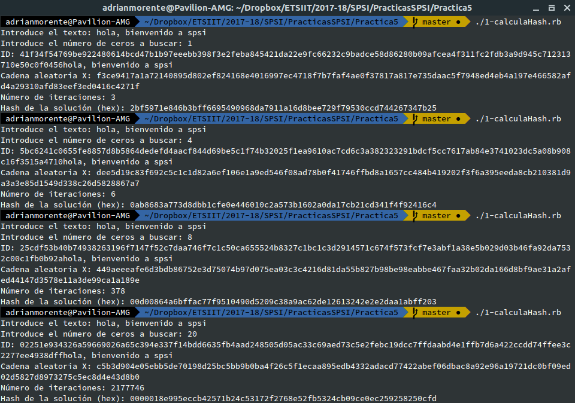

# Práctica 5 - Seguridad y Protección de Sistemas Informáticos
## PUZLES HASH
### Adrián Morente Gabaldón

***

***NOTA***: Antes de empezar, cabe destacar que utilizaré un valor para `n` de `256`; `SHA256` como método de hashing; y el texto se leerá siempre desde teclado de usuario.

Además, tenemos que saber que para una cadena binaria de 256 bits, en hexadecimal equivaldrá a 64 (256/4, que son los bits utilizados para representar un valor hexadecimal).

***

### 1. Para la función H, realizad, en el lenguaje de programación que queráis, una función que tome como entrada un texto y un número de bits `b`. Creará un id que concatene una cadena aleatoria de `n` bits con el texto. Pegará a ese `id` cadenas aleatorias `x` de `n` bits hasta lograr que `H(id||x)` tenga sus primeros `b` bits a cero. La salida será el `id`, la cadena `x` que haya proporcionado el hash requerido, el valor del hash y el número de intentos llevados a cabo hasta encontrar el valor `x` apropiado.

En mi caso, he implementado el programa en Ruby; y el código se trata del siguiente (en él se encuentran los comentarios correspondientes a la solución del ejercicio):

```ruby
#!/usr/bin/ruby
require 'digest'
require 'securerandom'

n = 256

print "Introduce el texto: "
texto = gets.chomp

print "Introduce el número de ceros a buscar: "
bits_cero = gets.to_i

# 1º - buscar una cadena aleatoria de n bits (en hex, n/4)
nonce = SecureRandom.hex(n/4)

# 2º - concatenarle el texto, y guardar como id
id = nonce + texto

# 3º - empiezo bucle, busco otra cadena aleatoria de n bits
terminado = false
contador = 0
hash = ""
while not terminado do
  terminado = true
  contador += 1

  x = SecureRandom.hex(n/4)

  # 4º - la concateno al id, y le aplico el hash
  aux = id + x
  hash = Digest::SHA256.hexdigest aux

  # 5º - convertimos el hash de hex a bin para buscar los ceros
  hash_bin = hash.hex.to_s(2).rjust(hash.size*4, '0')

  # 6º - si los b primeros bits del hash son cero, salgo del bucle
  for i in 0..bits_cero-1
    if hash_bin[i] != "0" then
      terminado = false
    end
  end
end

# 7º - salida, imprimimos contador, valor del hash y éste último en binario
puts "Número de iteraciones: #{contador}"
puts "Hash de la solución (hex): #{hash}"
puts "Hash de la solución (bin): #{hash_bin}"
```

Una muestra de su ejecución puede ser la siguiente:



***

### 2. Calculad una tabla/gráfica que vaya calculando el número de intentos para cada valor de `b`. Con el objeto de que los resultados eviten ciertos sesgos, para cada tamaño `b` realizad el experimento 10 veces y calculad la media del número de intentos.

El código de la solución es el siguiente. Contiene los comentarios necesarios para seguir el hilo de lo que se está haciendo.

```ruby
#!/usr/bin/ruby
require 'digest'
require 'securerandom'

n = 256

print "Introduce el texto: "
texto = gets.chomp

# buscar una cadena aleatoria de n bits (en hex, n/4)
nonce = SecureRandom.hex(n/4)

# concatenarle el texto, y guardar como id
id = nonce + texto

# empiezo bucle, busco otra cadena aleatoria de n bits
hash = ""

# vamos a contar desde 1 cero hasta 15
for bits_cero in 1..15
  # vamos a hacer 10 experimentos para cada valor de bits_cero
  media = 0
  for i in 1..10
    contador = 0
    terminado = false
    while not terminado do
      terminado = true
      contador += 1

      x = SecureRandom.hex(n/4)

      # la concateno al id, y le aplico el hash
      aux = id + x
      hash = Digest::SHA256.hexdigest aux

      # convertimos el hash de hex a bin para buscar los ceros
      hash_bin = hash.hex.to_s(2).rjust(hash.size*4, '0')

      # si los b primeros bits del hash son cero, salgo del bucle
      for j in 0..bits_cero-1
        if hash_bin[j] != "0" then
          terminado = false
        end
      end
    end
    media += contador
  end
  media /= 10
  puts "Media de iteraciones para b=#{bits_cero} --> #{media}"
end
```

Una posible solución bien podría ser la siguiente:

```
Introduce el texto: feliz navidad
ID: 2f835d76c54c218201cc39842d12e19593658c99cdca4f5a166f
77f0132fea0372e7410dbc841e72c6b977b1d8f833156ecce035db46
53a391e45a5038b42a6dfeliz navidad
Media de iteraciones para b=1 --> 2
 -> Hash de la solución (hex): 2449d36d557f57bbc57a2bdaf
 0ad3c72d33f2cbd11772a9396fc84756c24c474
 -> Cadena aleatoria X: 4459ad664488c16fa4a05da5d1fbc65e
 a3f257237c0603c54a09ffc123e792af4080aba23317e556698644e
 b7eaf05c422398ebd5f2219016c9405d485685255
Media de iteraciones para b=2 --> 3
 -> Hash de la solución (hex): 30a1a93b8a466120dfd9c5597
 f82c962888006f435caa5df5ae537fad05af60f
 -> Cadena aleatoria X: 7f32a87032fb4bf6de66d3172de4a361
 6c96cb9bc0ff42d8435eef6dfa248c3405100b4f2452011fce1818e
 f483454e9592332572d9f512305355fab3e4867a4
Media de iteraciones para b=3 --> 3
 -> Hash de la solución (hex): 0965d47d18e51ce7d4856c338
 159557954d925d3925ce1d03bf41418e3d36c26
 -> Cadena aleatoria X: 0f95ae9f4a7abb0d34f54f39908b220b
 7e5db6fc50554e0688a1475a07b8ef822bf0f65b280d4700d8abea5
 18c6921247103bb87d9a5ba0289e12e60ece2235f
Media de iteraciones para b=4 --> 14
 -> Hash de la solución (hex): 0ad382c673f24b7edb6d482c2
 88473b9b988d88e3de9150ce9552ec67abcac2c
 -> Cadena aleatoria X: 70cdfbf8ce010db465a300d2ca0aaedb
 035bbe529e9cbead569aac02277b29958dbdf2dbc1129abc01e7cf7
 08ff4c09dabbc9de3d7bd10467d611eea152c7ec0
Media de iteraciones para b=5 --> 26
 -> Hash de la solución (hex): 01af61113417510e6a37043df
 3efe33793ca9a420f34ac9545d76132cd3a8bf7
 -> Cadena aleatoria X: 17e7bf1ea28977809bb782efed28a7a8
 1b31e58d42c32d65ffb9a3fc9bc47ca53d8095c44db73cefad6bc4d
 f83353010ba6ae53f1da39b4e73971796d44034a3
Media de iteraciones para b=6 --> 55
 -> Hash de la solución (hex): 03dbc5fc3225aeb5601e5ffcd
 8abb29a92ba17f1573179754a1b9645d4b1a01d
 -> Cadena aleatoria X: c555375eb499540a7af5990b8dfbb399
 c164517383f1646d300a98c2377c8371f35aaed940ecf8512d82f7c
 a6b21b9ec447ac2b6f40bec5078606a5fe6a8b0bd
Media de iteraciones para b=7 --> 89
 -> Hash de la solución (hex): 01811072a2f0f1530f664bcd7
 c66b876d93080abf965f53b6d573d0a194ffec3
 -> Cadena aleatoria X: 73f0cfbf6bcb8f988048ee33b630ae23
 04cf5cbcfcfade632e1c442636067a003b2a1f729938e220271d40b
 7635fd903a3d5dacd55494f813e6ab6703edafdc4
Media de iteraciones para b=8 --> 186
 -> Hash de la solución (hex): 00196d9d566dd92e281c7d59d
 8a5a3113a4fc6f3db803054c134a14c614f80d6
 -> Cadena aleatoria X: 4055427dd713680a6ed2d6dcc9d9ed8c
 369ac36b381b8614687c9ccb8eaa2b2e3055f24145ecc28f330ed37
 c0194252bcec6da624b01379e0d1e6393ba19c6fe
Media de iteraciones para b=9 --> 424
 -> Hash de la solución (hex): 004de29dfc4f914e1faf44208
 41212afbf2cfe86b21646c2646aa8d40f96d15b
 -> Cadena aleatoria X: ff2591d80ed323453ecaf380fac92bbe
 67336773e2198057d53de3dae1f41b0bb5c20b30d2f3044e07380f2
 3b88a098f0d78d645d515dc63118b0e6e6c5b7318
Media de iteraciones para b=10 --> 1154
 -> Hash de la solución (hex): 00212a8b40e82aee47632519e
 fc44b83f3fba112ba6134e97c07961221d1d7e8
 -> Cadena aleatoria X: dcfadce8abe54bbe04078d62ae143ac5
 0842102418b12438dbbfbc0e57d356ef5db5ad3f343d5ef8c817c2b
 73672c00885c9acd9c7b75a488907d64b30b52ebb
Media de iteraciones para b=11 --> 3422
 -> Hash de la solución (hex): 00182c96999bcd323651129c4
 e55134e10a869697c04598cfebad8855ade2de5
 -> Cadena aleatoria X: e0bd0977bb604d61d47675845bb3302e
 4c8936dfe957466626d5baf32a6bd411d334b96920352caf64b7de2
 571d24beefb52052376eee3a12aaf44ae080d28d7
Media de iteraciones para b=12 --> 4217
 -> Hash de la solución (hex): 0003565c85c5fd2d013b38040
 3c1207b919ac7f29a1e214f1da6d1f25c048b90
 -> Cadena aleatoria X: afe2ba591cf5549843124af0069a602a
 b68981a1a76c66246b18dcbc6b07f6e2e64fa075e89aa6cf107a23f
 ebea35d5b1bb65439101adc6adae551ab931fd2ac
Media de iteraciones para b=13 --> 3168
 -> Hash de la solución (hex): 0004ea1fd32f103da5645625d
 fbbe0f1e209145bbac6d9c04761c20d7cde9ba1
 -> Cadena aleatoria X: 1dcd98107243ee3234e6341a2262c0e7
 97fbc43ab0894ce1e148d83eafff713773102ff49a94d541c316fe6
 f4a7b3c0215ce3b230344e61fc51a7953336a4946
Media de iteraciones para b=14 --> 10108
 -> Hash de la solución (hex): 000024bd9c8b41ba1ad6b5f5c
 7fc375ff2a053a06afb04a3422c2314e3cc8400
 -> Cadena aleatoria X: 239d3181830462f44b2b3e4070d6d3a2
 13cd9c5155d1b0f73859c573fcbca8c93afb68709380776f86faf46
 9085a4c272a3833dfc26bbfa1d7422ed44ab89db0
Media de iteraciones para b=15 --> 27523
 -> Hash de la solución (hex): 0001ffb3fae6fd73a354d251a
 138c2f6b1ee373f815285022185b92b655c42bc
 -> Cadena aleatoria X: 21552c395ca907744556d44d917bca6e
 27bcea754f986f4f0e210fb7bee886a1b95abe7904ae954ee146028
 b53927dab12886f7b2ad8e11fee1468b2d60aab4c
```

***

### 3. Repetid la función anterior con el siguiente cambio: se toma un primer valor aleatorio `x` y se va incrementando de 1 en 1 hasta obtener el hash requerido.

El código de la función 1 adaptado a este caso, sería similar al siguiente. Sin embargo, al no conseguir trabajar con las cadenas de hexadecimal a binario y viceversa, no consigo una ejecución viable...

```ruby
#!/usr/bin/ruby
require 'digest'
require 'securerandom'

n = 256

print "Introduce el texto: "
texto = gets.chomp

print "Introduce el número de ceros a buscar: "
bits_cero = gets.to_i

# buscar una cadena aleatoria de n bits (en hex, n/4)
nonce = SecureRandom.hex(n/4)

# concatenarle el texto, y guardar como id
id = nonce + texto

# empiezo bucle, busco otra cadena aleatoria de n bits
terminado = false
contador = 0
x = SecureRandom.hex(n/4)
aux = id + x
hash = Digest::SHA256.hexdigest aux

puts "x = #{x}"
puts "hash = #{hash}"

# mientras no encontremos bits_cero ceros al principio...
while not terminado do
  terminado = true
  contador += 1

  # convertimos el hash de hex a bin para buscar los ceros
  # convertimos x de string a binario para sumarle 1
  hash_bin = x.hex.to_s(2).rjust(x.size*4, '0')
  hash_bin = hash_bin.to_i(2)
  hash_bin += 1

  # y volvemos a convertir a string
  x = hash_bin.to_s(2)

  # si los b primeros bits del hash son cero, salgo del bucle
  for i in 0..bits_cero-1
    if hash_bin[i] != "0" then
      terminado = false
    end
  end
end

# salida, imprimimos contador, valor del hash y éste último en binario
puts "ID: #{id}"
puts "Cadena aleatoria X: #{x}"
puts "Número de iteraciones: #{contador}"
puts "Hash de la solución (hex): #{hash}"
```

***

### 4. Calculad una nueva tabla/gráfica similar a la obtenida en el punto 2 pero con la función construida en 3.

***
